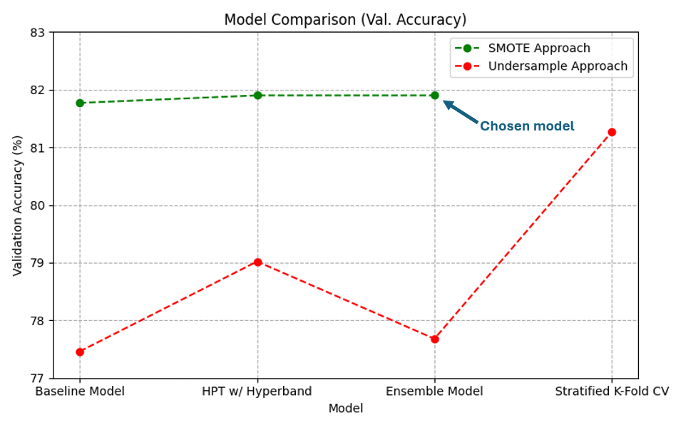
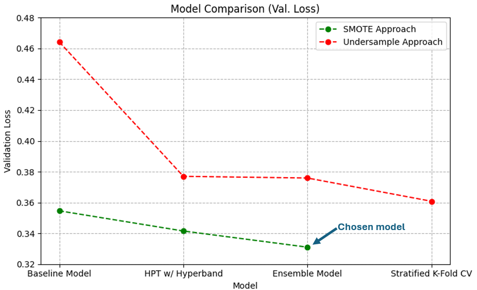

# Machine Learning - Predicting Repeat Customers
Using Deep Neural Networks built with TensorFlow to predict repeat audiobook customers for ad-targeting.

## Results
**Final Model - Test Accuracy: 82.62%**

Note: For both of these plots, the validation was plotted for the final epoch in each model's history object instead of history.history['val_accuracy'][-early_stopping.patience - 1], which would actually be representative of each model's validation performance. The validation accuracies for each model are actually slightly higher (roughly 0.5-1%) for each data point in the figure and the validation losses slightly lower. However, the most important metric to takeaway, the test accuracy of 82.62%, is correct.

## DNN Architecture and ML Workflow

#### Dataset / Inputs

#### Preprocessing

#### Architecture

## Hyperparameter Tuning

## Future Ways to Improve on This Specific Dataset
