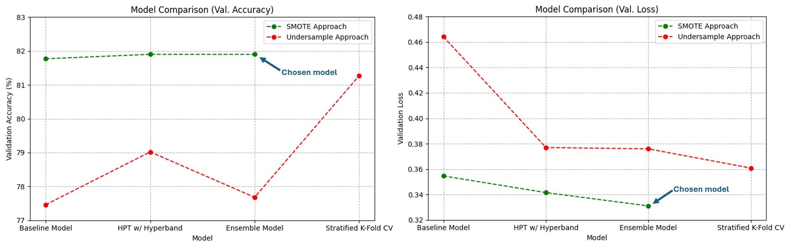
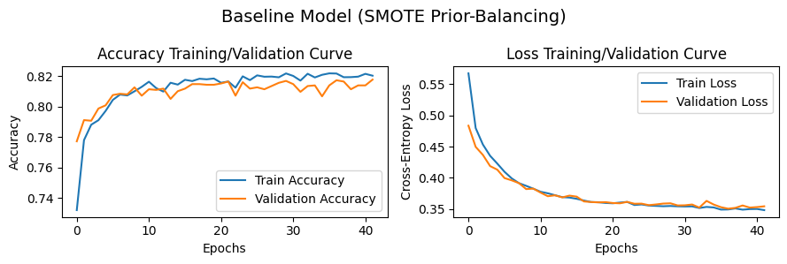
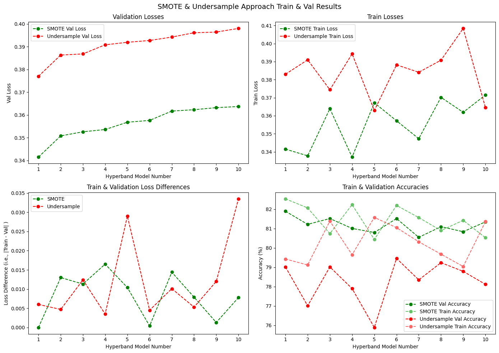
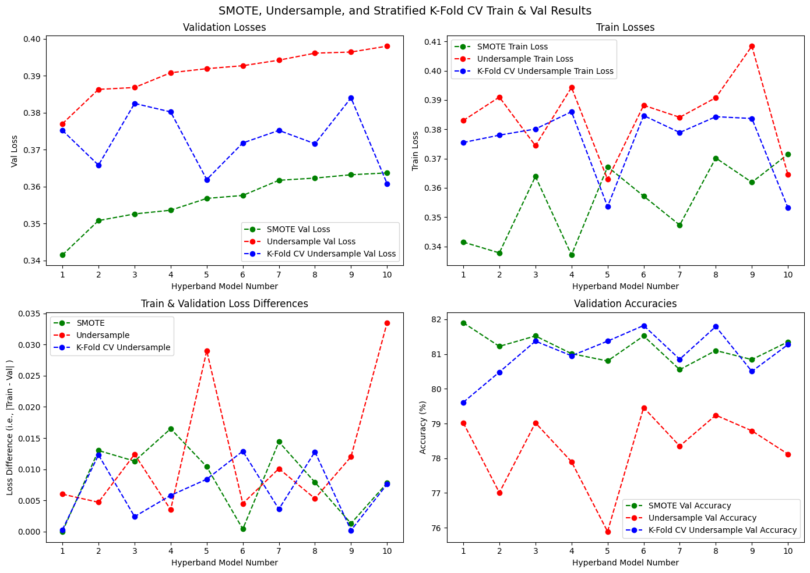
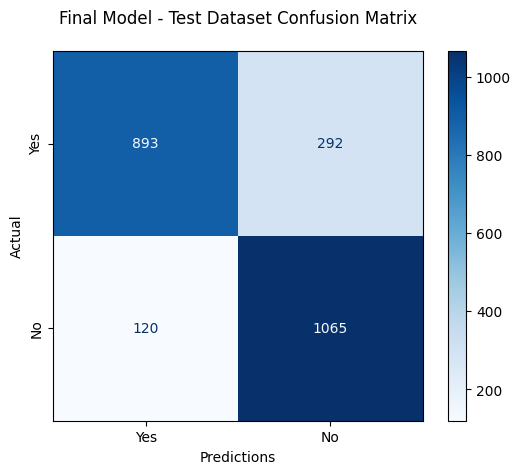

# Machine Learning - Predicting Repeat Customers
Using Deep Neural Networks built with TensorFlow to predict repeat audiobook customers for targeted advertising.

## Results
**Final Model - Test Accuracy: 82.62%**

## DNN Architecture and ML Workflow

### Overview / Table of Contents
**Objective:** To accurately predict which customers are likely to become repeat audiobook buyers within the next 6 months, based on user activity, purchase patterns, and other relevant features. These predictions will help the company target marketing and advertising efforts more effectively, focusing resources on customers with a higher likelihood of continued engagement.

1) [Info on the dataset and features/inputs](#1-dataset-and-features)
2) [Preprocessing](#2-preprocessing)
3) [Prior-Balancing Approach 1: Undersampling -  Baseline Model and Hyperparameter Tuning](#3-undersampling-approach-baseline-model-and-hyperparameter-tuning)
4) [Prior-Balancing Approach 2: SMOTE Oversampling - Baseline Model and Hyperparameter Tuning](#4-smote-approach-baseline-model-and-hyperparameter-tuning)
5) [Ensemble Learning](#5-ensemble-learning)
6) [Stratified K-Fold Cross Validation](#6-stratified-k-fold-cross-validation)
7) [Final Model and Testing](#7-final-model-and-testing)

### 1. Dataset and Features
- Data was collected over a 2.5 year period for over 14,000 customers.
- Data in all columns except the 'purchased_again' column reflects a 2 year period and are the model inputs. Info on each feature can be seen in the /src/data/data_columns_info.txt file.
- The 'purchased_again' column (T/F target col) reflects if the customer made another purchase in the 6 months right after that 2-year period.

### 2. Preprocessing
- Data was first cleaned using pandas, including operations like filling missing data using mean imputation/filling.
- Prior-balancing was performed using two main approaches: undersampling and SMOTE oversampling.
- Features were scaled using sklearn's preprocessing.scale() method.
- Data was shuffled and then split into 80%/10%/10% train/validation/test datasets.
- 6 arrays (X_train, X_val, X_test, y_train, y_val, y_test) were saved to an .npz file to later be loaded into ML notebooks as tensors.

### 3. Undersampling Approach: Baseline Model and Hyperparameter Tuning
- Input layer: 10 features.
- Multiple fully-connected/dense hidden layers. For the baseline model, used 2 sets of dense+dropout hidden layers, each with 64 neurons, a ReLU activation function, and L2 (ridge regression) regularization.
- Output layer of size 2, representing either True or False. Softmax activation function connecting to output layer.
- Adaptive Moment Estimation used for optimizer, Sparse Categorical Crossentropy used for loss, and a batch size of 128 was used.
- Early stopping implemented to prevent overfitting. Stopped when validation loss began increasing with a patience factor of 5, with restore_best_weights=True (i.e., once val_loss increased for 5 consecutive epochs, stop training and "roll back" the model).

- The following hyperparameters were tuned using Keras Tuner's Hyperband; the results for the best model are shown below.
  - num_hidden_layers = 5
  - hidden_layer_size = 16
  - activation = 'tanh'
  - dropout_rate = 0.2
  - l2_strength = 0.0009
  - learning_rate = 0.0051

### 4. SMOTE Approach: Baseline Model and Hyperparameter Tuning
- The same model architecture and Hyperband HPT process were performed again, but this time using the SMOTE-oversampled data.
- The training/validation curve for the baseline model can be seen below, with the model rolling back to epoch 36 where the validation loss was lowest. 

- The Hyperband HPT experiment was then performed. The hyperparamaters for the best two models can be seen below. These two were chosen to be displayed here, as they would later be ensembled into the final model.

| Hyperparameter    | Best Model | 2nd Best Model |
|-------------------|------------|----------------|
| num_layers        | 2          | 3              |
| hidden_layer_size | 128        | 16             |
| activation        | relu       | tanh           |
| dropout_rate      | 0.35       | 0.0            |
| l2_strength       | 0.00037    | 0.0002         |
| learning_rate     | 0.0002     | 0.0007         |

### 5. Ensemble Learning
The 10 best models from each prior-balancing approach were then analyzed to assess overfitting risk. These 20 models can be seen in the plot below.

The models using the SMOTE approach were clearly far superior in terms of the primary metric (validation loss). At this point, the best SMOTE model showed great promise, as not only did it have the lowest validation loss, but the difference between validation and training loss was almost 0. However, ensemble learning was also employed using a model-averging numpy approach. Multiple ensembles of SMOTE models were explored to assess different ensemble combinations' performances on the validation dataset. Finally, the best validation loss ended up being achieved by ensembling two models with the lowest validation losses. Additionally, the fact that these two models vary significantly in their hyperparameters (as shown in the table in section #4), the risk of overfitting is likely reduced by using this particular ensemble.

### 6. Stratified K-Fold Cross Validation
Despite the models trained on undersampled data performing poorer than the SMOTE models, I wanted to still give them the best chance of competing with the latter. Stratified k-fold cross validation was performed on the undersampled data using k=10 along with the hyperparameters from the 10 best Hyperband models. The results are shown below alongside the previous Hyperband results.

Employing stratified k-fold cross validation improved validation loss improvement on all 10 models. However, it was still not enough of an improvement to compete with the SMOTE-trained models. Therefore, the ensemble model found in section 7 was chosen as the final model.

### 7. Final Model and Testing
Now that a final model was chosen, the test dataset was used to establish the official performance benchmark. The final model achieved an **accuracy of 82.62%** and a **loss of 0.3306**. The predictions can be visualized through the below confusion matrix.

Finally, the progression of each model type and their performances can be seen in the [plot in the beginning of this README](#results).
